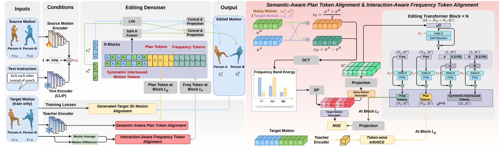

<div align="center">
 <h1>InterEdit</h1>
  
  <h3>InterEdit: Navigating Text-Guided Multi-Human 3D Motion Editing </h3>  
  
   
</div>

## Introduction
This repository is an implementation of InterEdit.


## Getting started

### 1. Setup environment

```shell
conda create -n InterEdit python=3.10
conda activate InterEdit
pip install -r requirements.txt
conda install -c conda-forge chumpy=0.70, numpy=2.2.6, scipy=1.15.2
```

### 2. Data Preparation


Download InterEdit3D dataset from [webpage](https://drive.google.com/drive/folders/1DccBLYvhMCBGXvDJcR9yBdBdeDArEdX1?usp=drive_link). And put them into ./data/interedit_processed.

#### Data Structure
```sh
<DATA-DIR>
./annots
./motions_processed    
./motions_source
./ignore_list.txt
./test.txt           
./train.txt
./val.txt     
```


### 3. Pretrained Models

Prepare the evaluation model

```shell
bash prepare/download_evaluation_model.sh
```

Download the pre-trained checkpoint of [InterEdit](https://drive.google.com/file/d/1hhjtksw8ZLHXV6ilG1ro0LRGKNKnPI3R/view?usp=drive_link)


## Train


Modify config files ./configs/model.yaml

```shell
python tools/train.py --LPA --epoch 1500 --exp-name interedit_train
```

## Evaluation


```shell
python tools/eval.py \
  --pth ./checkpoints/interedit.ckpt \
  --exp-name interedit_eval \
  --LPA
```


